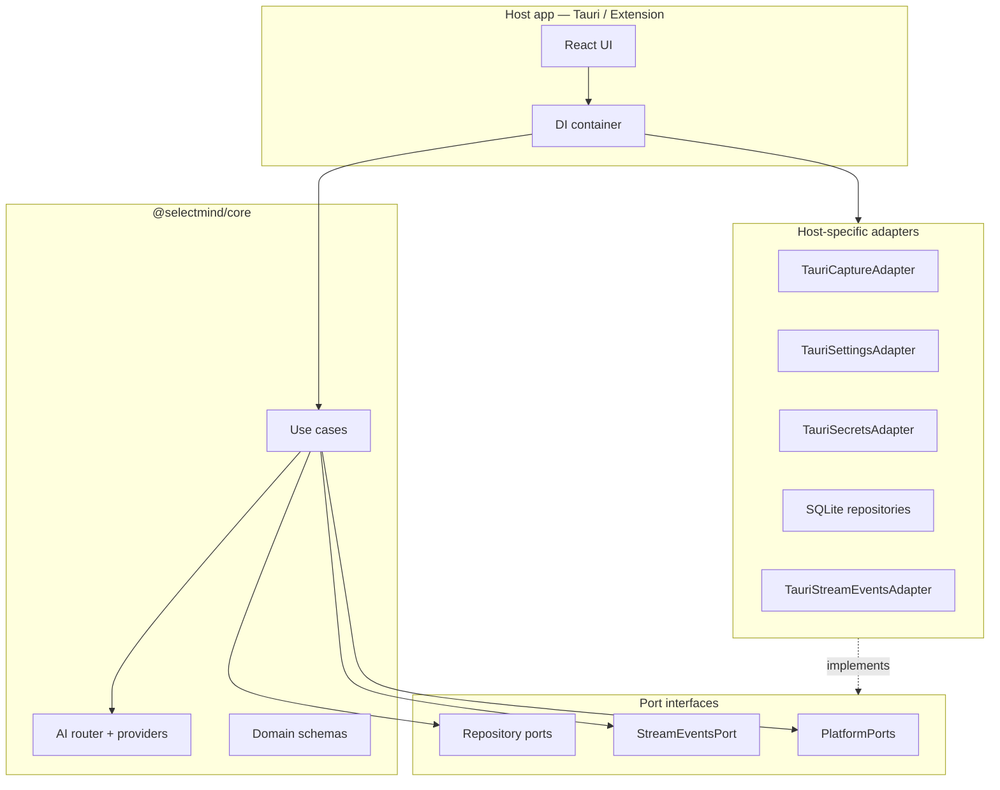

# Desktop adapter contract

> Phase 0 deliverable — how to plug SelectMind into a non-Chrome host (Tauri desktop first).

## Packages

| Package | Role | Chrome? | DOM? |
|---------|------|---------|------|
| `@selectmind/core` | Domain, use-cases, AI router, port interfaces | **No** | **No** |
| `@selectmind/shared` | Default actions/providers, page-context helpers, UI constants | **No** | Optional (`crop-image`, `createEmptyPageContext`) |
| `src/platform/extension` | Chrome adapters (reference implementation) | Yes | Yes |
| `src/infrastructure` | IndexedDB, RPC, crypto (extension-only for now) | Yes | Partial |

**Rule:** desktop reuses `@selectmind/core` + `@selectmind/shared`. It must **not** import `src/infrastructure` or `src/platform/extension`.

---

## Wiring overview



Extension today:

```typescript
const platform = createExtensionPlatform(); // PlatformPorts
const streamEvents = new ChromeStreamEventsAdapter();
const container = createContainer(platform); // wires repos + use-cases
```

Desktop (Phase 1 target):

```typescript
const platform = createTauriPlatform();
const streamEvents = new TauriStreamEventsAdapter();
// Same use-case constructors as extension — swap repositories for SQLite
```

---

## `PlatformPorts`

Bundle injected into capture flows and settings/secrets facades.

```typescript
interface PlatformPorts {
  secrets: SecretsPort;
  settings: SettingsPort;
  capture: CapturePort;
  ocr: OcrPort;
  hotkeys: HotkeyPort;
  pageContext: PageContextPort;
}
```

### `SecretsPort`

Stores provider API keys outside conversation DB.

| Method | Contract |
|--------|----------|
| `storeApiKey(providerId, key)` | Persist encrypted; overwrite existing |
| `getApiKey(providerId)` | `string` or `null` if missing |
| `deleteApiKey(providerId)` | Idempotent delete |
| `hasApiKey(providerId)` | `true` if retrievable key exists |

**Extension:** `ChromeSecretsAdapter` — WebCrypto + `chrome.storage.local`  
**Desktop:** OS keychain / Windows Credential Manager (Tauri plugin)

### `SettingsPort`

User preferences (not actions/conversations).

| Method | Contract |
|--------|----------|
| `get()` | Full `AppSettings` snapshot |
| `update(partial)` | Merge partial, return updated snapshot |

`AppSettings` fields: `defaultProviderId`, `defaultModel`, `theme`, `responseLanguage`, `toolbarActionIds`, `maxToolbarActions`, `conversationRetentionDays`, `saveConversationHistory`, `showFloatingToolbar`, `enableStreaming`, `onboardingCompleted`.

**Extension:** `ChromeSettingsAdapter` — `chrome.storage.local` + optional sync subset  
**Desktop:** SQLite table or JSON file in app data dir

### `CapturePort`

Screen capture for region-OCR flow. Picker UI stays in the host; core only needs cropped image data.

| Method | Required | Contract |
|--------|----------|----------|
| `captureVisibleSurface(options?)` | Yes | PNG/JPEG data URL of visible surface |
| `cropImage(source, region, dpr)` | No | Crop data URL to `ScreenRegion` (CSS px × DPR) |
| `captureRegion(region)` | No | Full `ScreenshotCapture` in one call |

`CaptureVisibleOptions`: optional `windowId` (browser), `format`, `quality`.

**Extension:** `ChromeCaptureAdapter` — `captureVisibleTab` via background message  
**Desktop:** Windows.Graphics.Capture / Tauri screenshot plugin

### `OcrPort`

| Method | Contract |
|--------|----------|
| `recognizeText(imageDataUrl, options?)` | Plain text; empty string if none |

`OcrOptions.languages` — BCP-47-ish hints (e.g. `['eng', 'rus']`).

**Extension:** `ChromeOcrAdapter` — tesseract.js  
**Desktop:** Windows OCR API or bundled tesseract

### `HotkeyPort`

| Method | Contract |
|--------|----------|
| `register({ id, accelerator, description? }, handler)` | Global shortcut; id stable for unregister |
| `unregister(id)` | Remove handler |

Accelerator format: `"Ctrl+Shift+X"` (same as extension command palette).

**Extension:** `ChromeHotkeyAdapter` — `chrome.commands`  
**Desktop:** Tauri global shortcut plugin

### `PageContextPort`

| Method | Contract |
|--------|----------|
| `extractCurrentContext()` | `PageContextSnapshot` sync or async |

`PageContextSnapshot`: `selection`, `pageTitle`, `url`, `hostname`, `language`, `date`, `time`, optional `screenshot`.

**Extension:** content script DOM + selection  
**Desktop:** active window title + OCR selection + optional URL (browser helper)

---

## `StreamEventsPort`

Not part of `PlatformPorts` — injected separately into streaming use-cases.

| Method | When |
|--------|------|
| `emitStreamChunk(conversationId, chunk)` | Each `StreamChunk` with `type: 'text'` |
| `emitStreamError(conversationId, error)` | Provider/network failure |
| `emitStreamDone(conversationId, messageId)` | Assistant message persisted |

**Extension:** `ChromeStreamEventsAdapter` → `PushEmitter` / `chrome.runtime`  
**Desktop:** Tauri event bus or WebSocket to UI webview

---

## Repository ports

IndexedDB implementations live in `src/infrastructure/storage/repositories`. Desktop Phase 1 adds SQLite (or Dexie in webview) classes implementing the same interfaces from `@selectmind/core`:

- `ActionRepositoryPort`, `CategoryRepositoryPort`
- `ConversationRepositoryPort`, `MessageRepositoryPort`
- `ProviderRepositoryPort`, `PipelineRepositoryPort`

Use-cases depend only on these interfaces — no schema knowledge of storage backend.

---

## Shared capture / OCR pipeline

Host implements ports; flow stays in extension content layer until moved to core:

1. User triggers hotkey → region picker (host UI)
2. `platform.capture.captureVisibleSurface()` → full screenshot data URL
3. Crop with `platform.capture.cropImage` or `@selectmind/shared` `cropImageDataUrl`
4. `platform.ocr.recognizeText(croppedUrl)`
5. Build `PageContext` / `ContextBundle` → `StreamConversationUseCase.execute`

Desktop reuses steps 2–5 unchanged once ports exist.

---

## AI layer

No port needed for providers — configure at startup:

```typescript
import { providerRegistry } from '@selectmind/core';

providerRegistry.loadFromConfigs(providerConfigs, apiKeysMap);
```

Uses `fetch` (available in Tauri webview). API keys come from `SecretsPort`.

---

## Verification (Phase 0)

Automated guard in `tests/unit/core/platform-isolation.test.ts`:

- No `chrome` imports in `packages/core`
- No `@/` extension aliases in core
- Core does not import `@selectmind/shared`

Run full gate:

```bash
npm run build
npm test
```

---

## Phase 1 checklist ✅

- [x] `apps/desktop` Tauri 2 skeleton
- [x] `createTauriPlatform(): PlatformPorts`
- [x] `TauriStreamEventsAdapter`
- [x] SQLite repositories implementing repository ports
- [x] Sidepanel-equivalent window + in-process RPC (reuse `presentation/`)
- [x] Provider settings UI
- [x] Global hotkey + transparent overlay region picker
- [x] System tray + close-to-tray (Phase 4)

## Phase 4 checklist ✅

- [x] Dedicated transparent `capture-overlay` window
- [x] Multi-monitor capture (cursor monitor)
- [x] System tray for background hotkey use
- [x] OS keychain for API keys (Windows Credential Manager)
- [x] Autostart at Windows login (`--minimized` to tray)
- [x] Windows OCR API (`Windows.Media.Ocr`) + Tesseract fallback
- [x] Gaming disclaimer + [DESKTOP_CAPTURE.md](./DESKTOP_CAPTURE.md)
- [x] General settings UI (desktop)

## Phase 5 / 5.1 checklist ✅

- [x] Actions library + custom action editor
- [x] Command palette (`Ctrl+Shift+P`)
- [x] Pipelines browse UI
- [x] Import / export backup
- [x] Onboarding wizard (desktop variant)
- [x] Provider API keys → Windows Credential Manager (`keyring` + `windows-native`)
- [x] Tauri ACL permissions for app IPC commands
- [x] Global floating toolbar (UIA + Win32 fallback) — [DESKTOP_TOOLBAR.md](./DESKTOP_TOOLBAR.md)
- [x] Floating chat popup (ChatView overlay, drag/resize/expand)
- [x] Toolbar customizer in Settings
- [x] OCR toolbar + OCR chat hotkeys
- [x] Custom global hotkeys in Settings

## Phase 6 checklist 🟡

- [x] NSIS packaging (`npm run desktop:package`)
- [x] Smoke test checklist — [DESKTOP_RELEASE.md](./DESKTOP_RELEASE.md)
- [ ] Code signing (OV/EV certificate)
- [ ] Tauri auto-updater

See [DESKTOP_PORTING_PLAN.md](./DESKTOP_PORTING_PLAN.md) for full roadmap.
