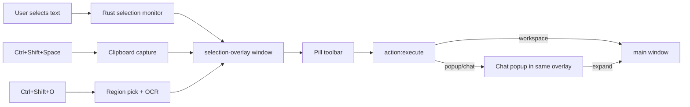

# Desktop selection overlay — toolbar + chat popup

> Extension reference: select text → toolbar → action → floating chat popup.

## Status: ✅ shipped (Phase 5.1)

## Flow

## Tauri windows

| Label | Role |
|-------|------|
| `main` | Workspace + settings |
| `capture-overlay` | Region picker for OCR |
| `selection-overlay` | Toolbar + chat popup (transparent, always-on-top) |

## Rust (`src-tauri/src/selection/`)

| Module | Role |
|--------|------|
| `monitor.rs` | Poll selection, show/hide overlay, sticky OCR toolbar mode |
| `win.rs` | UIA + Win32 Edit fallback (Notepad) |
| `clipboard.rs` | Ctrl+C capture for manual toolbar hotkey |
| `com.rs` | UIA worker thread (MTA) |
| `positioning.rs` | Compact toolbar window bounds |

## Frontend

| Piece | Location |
|-------|----------|
| Overlay app | `apps/desktop/src/selection/SelectionOverlayApp.tsx` |
| Popup drag/resize | `apps/desktop/src/selection/popup-hooks.ts` |
| Positioning | `apps/desktop/src/selection/positioning.ts` |
| Chat body | shared `ChatView` (compact) |
| Hotkeys config | `apps/desktop/src/settings/desktop-hotkeys.ts` |

Default popup size: **560 × 600** px (resizable, persisted in session).

## Chat popup features

- [x] Header: icon, title, expand (⤢), close (×)
- [x] Context chips + Add selection
- [x] Streaming + follow-up messages
- [x] Drag header, resize corner, font scales with size
- [x] Keyboard focus in popup (dynamic `WS_EX_NOACTIVATE` toggle)
- [x] Click outside → close (400 ms grace)

## Settings

| Setting | Location |
|---------|----------|
| Show floating toolbar on selection | General |
| Toolbar action icons | Toolbar tab |
| Custom hotkeys | General → Keyboard shortcuts |

## Edge cases

| Case | Behavior |
|------|----------|
| Games / exclusive fullscreen | Use **OCR toolbar** (`Ctrl+Shift+O`) |
| No UIA selection | **Ctrl+Shift+Space** (clipboard) or OCR toolbar |
| Multi-monitor | Overlay positioned on monitor containing selection |
| OCR from main window | Main window hidden during capture |

## Out of scope

- Injecting into other processes / Windows context menu entries
- `QuickActionPopup` without follow-up (popup mode covers this)
